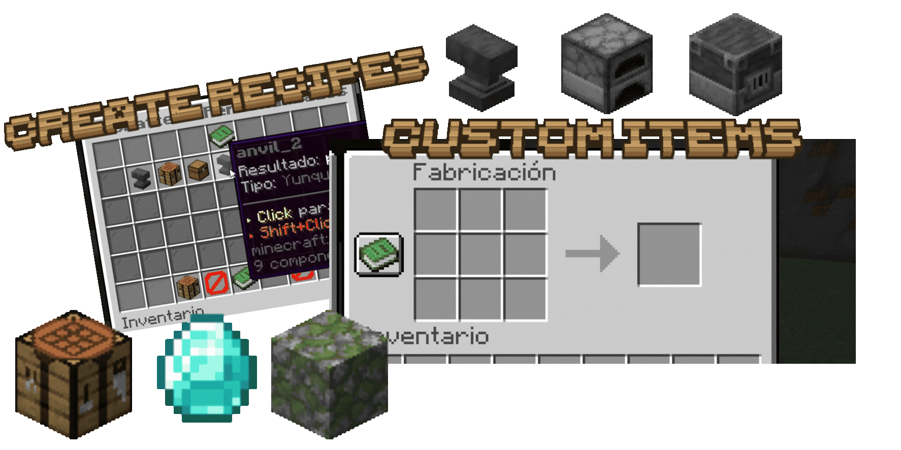
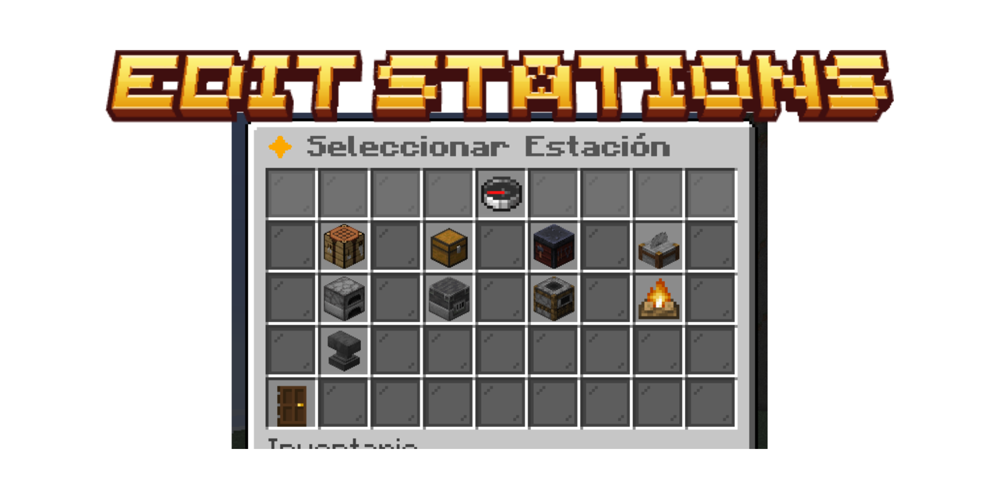
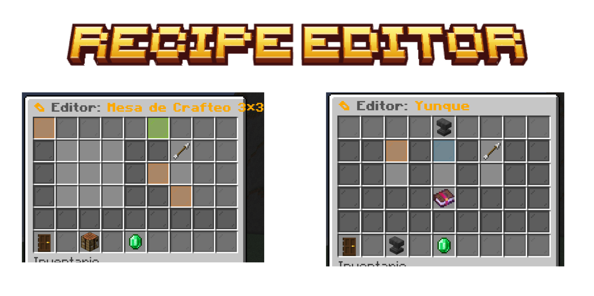
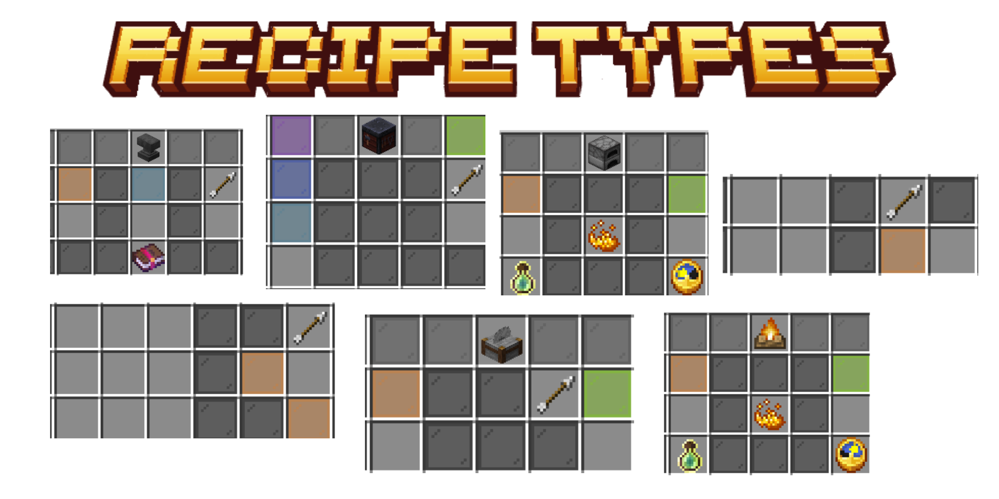
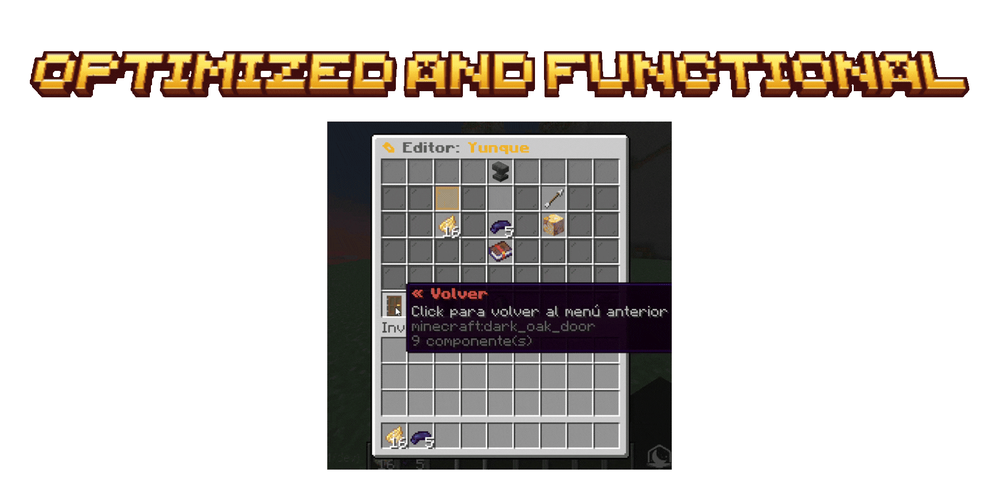
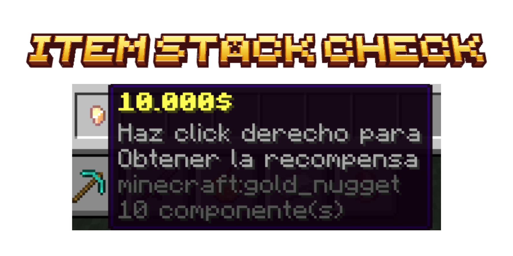
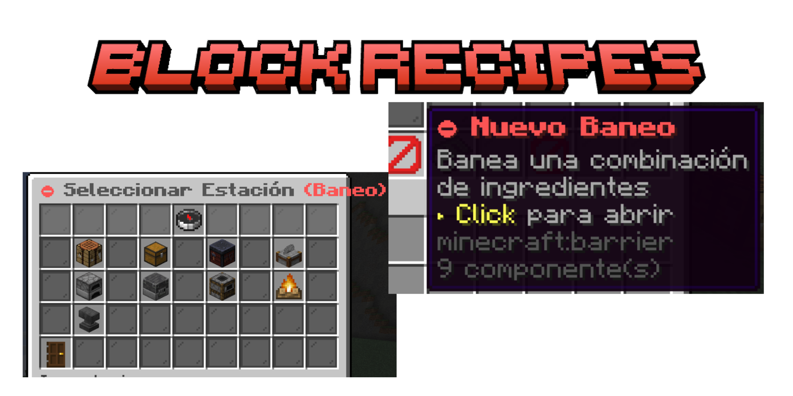
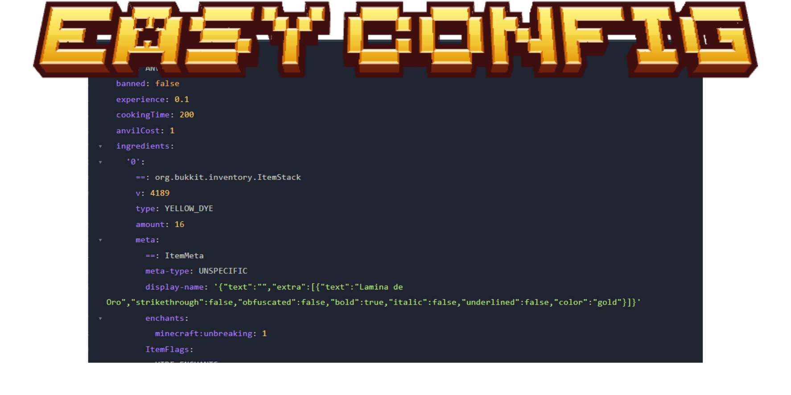

<p align="center">
  
</p>

<h1 align="center">CrafteosASD</h1>

<p align="center">
  Advanced Crafting Infrastructure • Modular Recipe Framework • Progression-Based Crafting
</p>

<p align="center">
  
</p>

<p align="center">
  
  
  
  
</p>

<p align="center">
  
  
  
</p>

---

<p align="center">
  
</p>

<p align="center">
  
</p>

CrafteosASD is an advanced crafting infrastructure plugin focused on creating progression-oriented, modular and highly customizable crafting systems.

Rather than simply adding recipes, the plugin was designed to completely control crafting progression and custom item integration.

Features:
-  Custom crafting recipes
-  Anvil recipes
-  Furnace systems
-  Recipe infrastructure
-  Recipe blocking
-  GUI editors
-  Custom item integrations

Unlike traditional recipe plugins, CrafteosASD behaves as a complete crafting progression framework.

---

<p align="center">
  
</p>

<p align="center">
  
</p>

```txt
/crafteos
/crafteos editor
/crafteos reload
```

<details>
<summary>

View Detailed Command Infrastructure
</summary>

<br>

The command architecture inside CrafteosASD was designed around a GUI-oriented workflow.

Instead of manually editing complex configuration files, recipes and crafting systems can be managed directly in-game.

###  Centralized Management

Administrators can:
- create recipes
- modify crafting types
- block recipes
- edit outputs
- configure ingredients
- manage recipe stations
- reload systems dynamically

without requiring server restarts.

### <span style="color:#D6B37A"><b>Infrastructure-Oriented Design</b></span>

The plugin was specifically designed to support large crafting ecosystems rather than isolated recipes.

</details>

---

<p align="center">
  
</p>

<p align="center">
  
</p>

<details>
<summary>

View Detailed Station Infrastructure
</summary>

<br>

CrafteosASD supports multiple crafting infrastructures rather than relying exclusively on vanilla crafting tables.

Supported stations:
- Crafting Tables
- Furnaces
- Blast Furnaces
- Smokers
- Anvils

###  Modular Recipe Systems

Each station can support:
- independent recipes
- progression systems
- custom ingredients
- advanced outputs
- custom restrictions

allowing servers to completely redesign survival progression.

### <span style="color:#D6B37A"><b>Advanced Gameplay Possibilities</b></span>

Possible implementations:
- magical crafting
- industrial progression
- RPG forging
- advanced smelting
- technology systems
- custom survival trees

</details>

---

<p align="center">
  
</p>

<p align="center">
  
</p>

<details>
<summary>

View Detailed Recipe Editor
</summary>

<br>

The Recipe Editor is one of the core systems inside CrafteosASD.

It was designed to provide complete in-game control over recipe creation and crafting logic.

###  Recipe Infrastructure

Recipes support:
- shaped crafting
- custom outputs
- metadata checks
- ingredient validation
- station restrictions
- dynamic behavior

###  GUI Workflow

The editor allows:
- visual recipe creation
- live modifications
- ingredient replacement
- custom outputs
- crafting previews

making the entire workflow significantly faster and cleaner.

### <span style="color:#D6B37A"><b>Scalable Recipe Ecosystem</b></span>

The objective was creating an infrastructure capable of handling hundreds of custom recipes efficiently.

</details>

---

<p align="center">
  
</p>

<p align="center">
  
</p>

<details>
<summary>

View Detailed Recipe Types
</summary>

<br>

CrafteosASD supports multiple recipe infrastructures beyond vanilla crafting.

Supported systems:
- crafting recipes
- furnace recipes
- smoker recipes
- blast furnace recipes
- anvil recipes

###  Specialized Crafting

This allows servers to create:
- forging systems
- magical crafting
- industrial progression
- equipment upgrading
- custom refining mechanics

instead of limiting gameplay to normal crafting tables.

</details>

---

<p align="center">
  
</p>

<p align="center">
  
</p>

<details>
<summary>

View Detailed Crafting Showcase
</summary>

<br>

Crafting interactions inside CrafteosASD were designed to feel modern, responsive and progression-oriented.

###  Dynamic Crafting

The crafting engine supports:
- custom outputs
- advanced validation
- custom stations
- progression locking
- recipe restrictions
- item comparisons

allowing servers to build fully custom crafting ecosystems.

</details>

---

<p align="center">
  
</p>

<p align="center">
  
</p>

<details>
<summary>

View Detailed Integration Support
</summary>

<br>

CrafteosASD supports modern custom-item ecosystems.

Supported integrations:
- ItemsAdder
- Oraxen
- Nexo

###  Advanced Possibilities

This allows:
- magical recipes
- RPG crafting
- custom technologies
- energy systems
- progression artifacts
- industrial crafting

without being restricted to vanilla Minecraft items.

</details>

---

<p align="center">
  
</p>

<p align="center">
  
</p>

<details>
<summary>

View Detailed Comparison System
</summary>

<br>

The Item Comparison system inside CrafteosASD was designed to support advanced recipe validation.

###  Advanced Validation

Recipes can validate:
- item metadata
- custom model data
- NBT structures
- enchantments
- durability
- exact item matches

allowing highly precise crafting systems.

### <span style="color:#D6B37A"><b>Technical Infrastructure</b></span>

This system is especially important for:
- RPG servers
- progression systems
- custom economies
- advanced survival
- industrial gameplay

where recipes cannot rely exclusively on vanilla comparisons.

</details>

---

<p align="center">
  
</p>

<p align="center">
  
</p>

<details>
<summary>

View Detailed Recipe Blocking
</summary>

<br>

CrafteosASD includes a complete recipe restriction infrastructure allowing servers to fully control progression and crafting access.

###  Vanilla Recipe Control

Servers can:
- disable vanilla recipes
- block progression skips
- redesign survival progression
- restrict advanced crafting
- protect progression balance

### <span style="color:#D6B37A"><b>Progression-Oriented Crafting</b></span>

Possible implementations:
```txt
Stone Age
↓
Iron Age
↓
Magic Age
↓
Technology Age
```

This allows crafting to become a gameplay progression mechanic rather than a static vanilla feature.

###  Economy Protection

Recipe blocking also helps:
- avoid bypasses
- prevent economy inflation
- synchronize progression systems
- protect server balance

</details>

---

<p align="center">
  
</p>

<p align="center">
  
</p>

<details>
<summary>

View Detailed Configuration System
</summary>

<br>

The configuration infrastructure inside CrafteosASD was designed around scalability and modularity.

###  Dynamic Infrastructure

Supports:
- dynamic reloads
- persistent recipes
- modular systems
- scalable recipe management
- synchronized integrations

allowing servers to maintain large crafting ecosystems efficiently.

</details>

---

<p align="center">
  
</p>

#  PERMISSIONS

```txt
crafteosasd.admin
crafteosasd.editor
crafteosasd.reload
```

---

<p align="center">
  
</p>

#  DOWNLOAD

CrafteosASD is distributed only as a compiled `.jar`.

The source code remains private because this plugin was developed exclusively for my own Minecraft infrastructure and gameplay ecosystem.

<p align="center">
  <a href="https://github.com/ItsAsddd/CrafteosASD/releases">
    
  </a>
</p>

---

```txt
Minecraft Version: 1.21.4
Server Software: Paper
Dependencies: PlaceholderAPI (Optional)
Project Type: Personal / Private Infrastructure
Source Code: Private
Public Usage: Showcase only
```

<p align="center">
  
  
  
</p>
